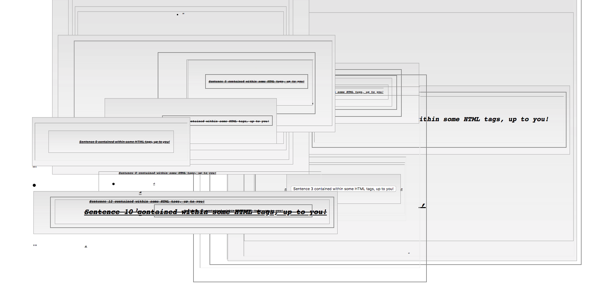
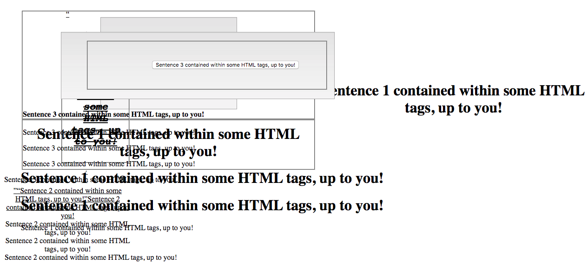
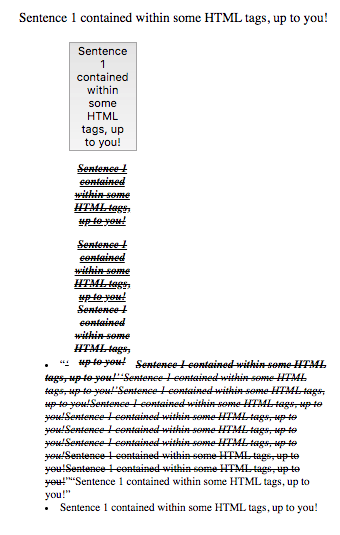
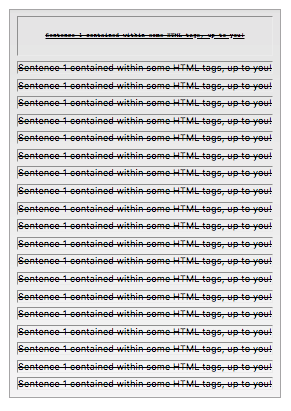

# internet-art-final

This, my final project for the class Intermediate Internet Art, is titled Any HTML. This piece is heavily inspired by [All HTML](http://all-html.net/) by Evan Roth. The main principle behind my piece is using the DOM API to create an interactive, manipulable interpretation of the messages I interpreted from All HTML. You can access this project online [here](https://wolfpeyton.github.io/internet-art-final/).

## Directions For Use

- Clicking on an unoccupied portion of the page creates a new sentence in a random HTML element.
- Clicking on an existing HTML element nests that element in another random element.
- Pressing the down arrow key nests every element on the page in another random element.
- Pressing the left arrow key clones the bottom element of every element tree contained in the body within its level.

## Explanation of Significance

What I intend to communicate with this piece is the possibility to create chaos using only a few simple elements and rules. With the html tags that create every single website available to us, I've created a system that generates permutations of these which a human would almost never create on their own, either because they're not useful or because they're too unwieldy. The result is glitch art and incomprehensibility.

# Examples

Here are a few examples I made just playing around with this piece.

